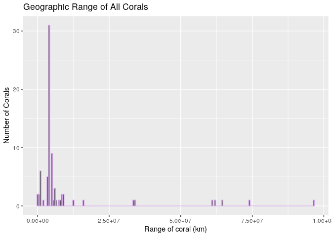

<!-- README.md is generated from README.Rmd. Please edit that file -->

<!-- You'll still need to render `README.Rmd` regularly, to keep `README.md` up-to-date. `devtools::build_readme()` is handy for this.  -->

# Coral R data package

<!-- badges: start -->

<!-- badges: end -->

The goal of the coral package is to provide data on the species and
characteristics of corals around the globe. This dataset is managed by
the Coral Trait Database, and serves as a regulated repository for
survey data collected on corals by many different research groups and
projects.

## Installation

The development version of 0.1.0 is available from
[GitHub](https://github.com/) with:

``` r
#only use auth_token if pkgGrph is a private repo
install.packages("devtools")
devtools::install_github("Reed-Math241/pkgGrph", 
                         auth_token = key)
```

## Data Format

This data is organized such that each species of coral has values for
the ocean it is predominantly found in (ocean\_basin), the preferred
clarity of the coral’s waters (water\_clarity\_preference), and the
estimated geographic range of the coral.

## Example

In this example we will show you how to evaluate the global distribution
of ranges of corals. These can very dramatically depending on the
ecosystem and reproductive strategies of the coral.

### Load Package

``` r
library(coral)
library(tidyverse)
#> ── Attaching packages ─────────────────────────────────────── tidyverse 1.3.0 ──
#> ✓ ggplot2 3.3.3     ✓ purrr   0.3.4
#> ✓ tibble  3.0.6     ✓ dplyr   1.0.4
#> ✓ tidyr   1.1.2     ✓ stringr 1.4.0
#> ✓ readr   1.4.0     ✓ forcats 0.5.0
#> ── Conflicts ────────────────────────────────────────── tidyverse_conflicts() ──
#> x dplyr::filter() masks stats::filter()
#> x dplyr::lag()    masks stats::lag()
```

### Create a histogram based on the range size of corals.

``` r
rangesize_plot <- ggplot(data = coral, mapping = aes(x = range_size)) + 
  geom_histogram(binwidth = 500000, color = "#D5A5EA") + 
  labs(x = "Range of coral (km)", y = "Number of Corals", 
       title = "Geographic Range of All Corals")
rangesize_plot
```

  Here we can see that the
majority of corals have a relatively small range with a smaller number
that have an exceedingly large range. These could be deep sea corals
that reproduce by freely releasing offspring or they could be corals
that are capable of growing in a large variety of different habitats.
But we’ll leave it up to you to figure that out.
